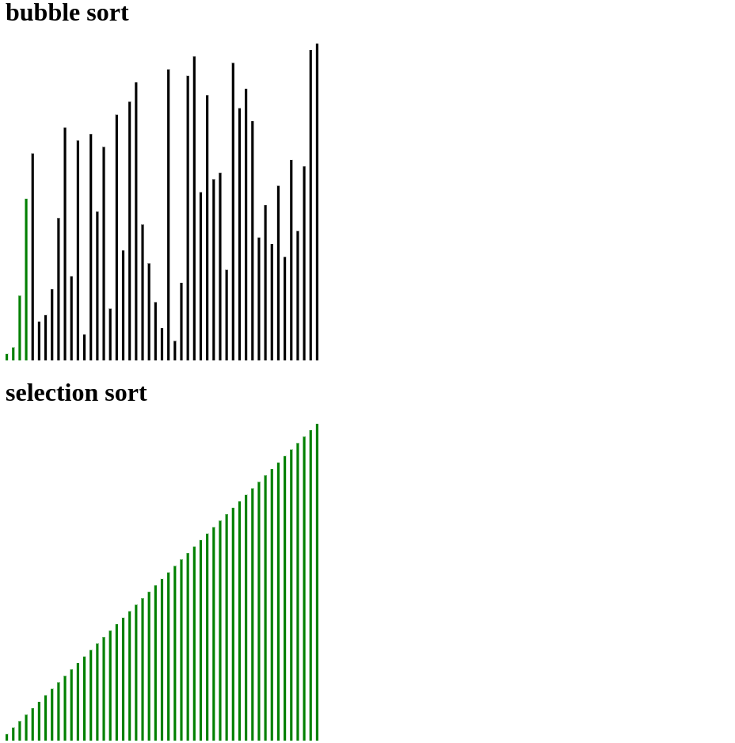

# Algorithm Visualiser

This is a Project to demonstrate how the new `Proxy` class in Javascript might be used



## Usage

In code you wouldnt need to change the implementation of your particular sort Algorithm as we just
create a Proxied array that logs every change made to the array.

```javascript
// Generic implementation of bubbleSort and selectionSort
function bubbleSort(arr) {
    var len = arr.length;
    for (var i = len - 1; i >= 0; i--) {
        for (var j = 1; j <= i; j++) {
            if (arr[j - 1] > arr[j]) {
                var temp = arr[j - 1];
                arr[j - 1] = arr[j];
                arr[j] = temp;
            }
        }
    }
    return arr;
}

function selectionSort(arr) {
    var minIdx, temp,
        len = arr.length;
    for (var i = 0; i < len; i++) {
        minIdx = i;
        for (var j = i + 1; j < len; j++) {
            if (arr[j] < arr[minIdx]) {
                minIdx = j;
            }
        }

        temp = arr[i];
        arr[i] = arr[minIdx];
        arr[minIdx] = temp;
    }
    return arr;
}

const proxiedArray1 = createVisualisableArray(randomArray1, visualiser);
const proxiedArray2 = createVisualisableArray(randomArray2, visualiser2);

bubbleSort(proxiedArray1);
selectionSort(proxiedArray2);
```
